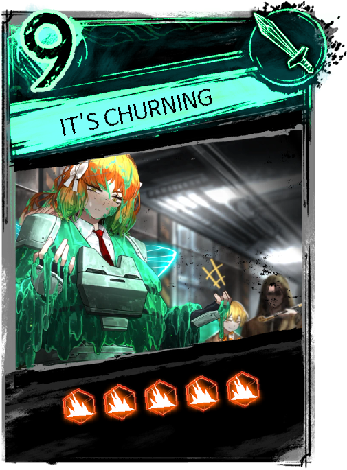

Currently in Development, at some point will be published!

# Library of Ruina Card Generator

Small library to generate cards as if they were from Library of Ruina.

### Examples

| Ryoshu                                 | Ishmael                                   |
| -------------------------------------- | ----------------------------------------- |
|  |  |

### TODO Before publishing

- Add missing card types (Special)
- Add missing attack types (Counter die)
- Add missing combat pages
- Map all pages (So they can be generated easily/as defaults)
- Add CLI usage (Alongside using classes from the package)
- Refactor + Clean up
- Error handling / Messages about the generation
- Version bump (1.0.0)

### TODO after the TODO

- Work on the right side of the page (Skill effects / damage)
- Lose less quality when rotating icons

Big thanks to that one Google drive that has all the pictures. (Will look for it later!)
